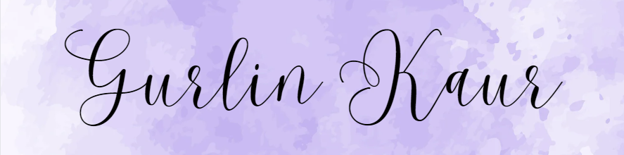

  

## About me

Hello world👋. I am Gurlin Kaur, a junior Software Developer and a student based in Winnipeg, Canada.

I am basically from India and moved to Canada to pursue software development. I find joy in coding and listening to music.

My programming experience includes 💻 HTML, 🎨 CSS, and 🚀 JavaScript. I am excited to learn more and deepen my knowledge and become a professional developer.

- 📚 I’m currently studying software development at MITT, Winnipeg.
- 🌱 I’m currently learning JavaScript.
- 👯 I’m looking to collaborate on open source/commercial projects

## My skills
&nbsp;
&nbsp;
&nbsp;
<!-- 

 -->

<!--
**Gurlinkaur23/Gurlinkaur23** is a ✨ _special_ ✨ repository because its `README.md` (this file) appears on your GitHub profile.

Here are some ideas to get you started:

- 🔭 I’m currently working on ...
- 🌱 I’m currently learning ...
- 👯 I’m looking to collaborate on ...
- 🤔 I’m looking for help with ...
- 💬 Ask me about ...
- 📫 How to reach me: ...
- 😄 Pronouns: ...
- ⚡ Fun fact: ...
-->
